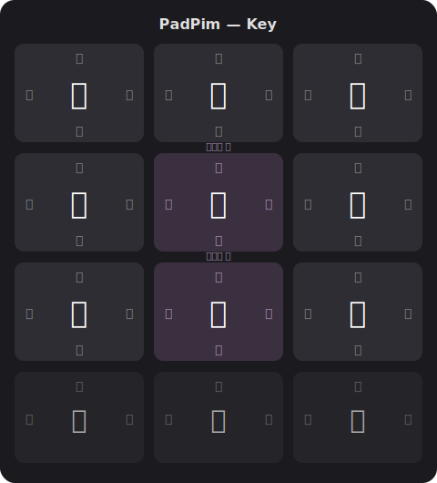
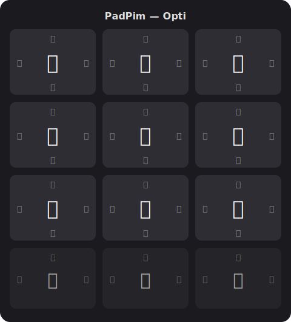
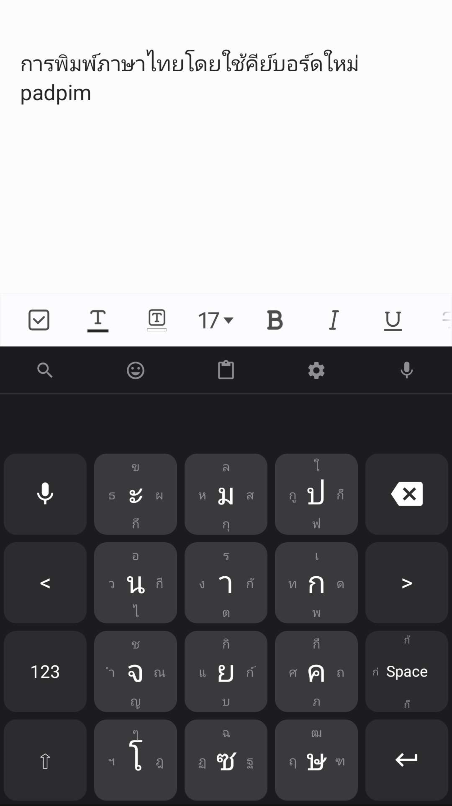

<p align="center">
  

<h3 align="center">แป้นพิมพ์สะบัดไทย — Thai Flick Keyboard</h3>
<p align="center"><em>From 69 Characters to 12 Keys</em></p>

<p align="center">
  <a href="https://doi.org/10.5281/zenodo.19472287"></a>
  
  
  
</p>

---

**PadPim** is a corpus-driven flick keyboard for one-handed Thai mobile input. Each key holds 5 characters — tap for the center character, swipe in any direction for the others. The layout is optimized using frequency data from a 354-million-character Thai corpus.

**PadPim** คือแป้นพิมพ์สะบัดสำหรับภาษาไทย ออกแบบจากข้อมูลความถี่ตัวอักษรจากคลังข้อมูลภาษาไทยกว่า 354 ล้านตัวอักษร แต่ละปุ่มบรรจุ 5 ตัวอักษร — แตะเพื่อพิมพ์ตัวกลาง สะบัดเพื่อพิมพ์ตัวอื่น

---

## Features / คุณสมบัติ

- **Flick input** — 5 characters per key (tap + 4 directions) / สะบัด 5 ทิศทางต่อปุ่ม
- **Corpus-driven layout** — optimized from 354M character Thai corpus / จัดเรียงจากคลังข้อมูล 354 ล้านตัวอักษร
- **98.3% coverage** — 57 characters on the main page cover nearly all Thai text / ครอบคลุม 98.3% ของข้อความไทย
- **Two layout variants** — Key (learner-friendly) and Opti (speed-optimized) / 2 รูปแบบ: Key (เรียนง่าย) และ Opti (เร็วสุด)
- **Word prediction** — smart suggestions as you type / คาดเดาคำอัจฉริยะ
- **Emoji panel** — flick-based emoji input / แผงอิโมจิแบบสะบัด
- **Clipboard history** — access recent copies, fully offline / ประวัติคลิปบอร์ด
- **Haptic feedback** — customizable vibration / สั่นตอบสนองปรับได้
- **Light & dark themes** — follows system or manual toggle / ธีมสว่างและมืด
- **Custom layout editor** — rearrange keys to your preference / แก้ไขตำแหน่งปุ่มได้
- **One-handed operation** — compact 3x4 grid designed for thumb reach / ใช้มือเดียวสะดวก
- **Fully offline & private** — no internet permission required / ไม่ต้องใช้อินเทอร์เน็ต ปลอดภัย

---

## How Flick Input Works / วิธีการใช้งาน

Each key responds to 5 gestures — a tap and 4 swipe directions:

แต่ละปุ่มรองรับ 5 ท่าทาง — แตะ 1 ครั้ง และสะบัด 4 ทิศทาง:

```
              ↑ swipe up
              เ
              
  swipe left  ← [  า  ] →  swipe right
              ั          ี
              
              ↓ swipe down
              ะ
```

> **Example**: On the า key, tap = า, swipe up = เ, swipe left = ั, swipe right = ี, swipe down = ะ

> **Tone marks / วรรณยุกต์**: ่ ้ ๊ are accessed by swiping on the **Space** key

---

## Keyboard Layouts / รูปแบบแป้นพิมพ์

### PadPim - Key (Vowel-Grouped / จัดกลุ่มสระ)

Vowels are grouped on 2 dedicated keys (pink), making it easier to learn. Best for beginners.

สระถูกจัดกลุ่มไว้บน 2 ปุ่มเฉพาะ (สีชมพู) เรียนรู้ง่าย เหมาะสำหรับผู้เริ่มต้น

<p align="center">
  
</p>

### PadPim - Opti (Frequency-Optimized / เรียงตามความถี่)

Every character is placed purely by frequency score (grid position x flick difficulty). Fastest possible typing, but harder to memorize.

ทุกตัวอักษรจัดวางตามคะแนนความถี่ล้วนๆ (ตำแหน่งบนตาราง x ความยากของสะบัด) พิมพ์เร็วที่สุด แต่จำยากกว่า

<p align="center">
  
</p>

> Large character = **tap**, small characters = **swipe** in that direction (up/down/left/right)
> 
> ตัวอักษรใหญ่ = **แตะ**, ตัวอักษรเล็ก = **สะบัด** ไปทิศทางนั้น (บน/ล่าง/ซ้าย/ขวา)

---

## Screenshot / ภาพหน้าจอ

<p align="center">
  
</p>

---

## Installation / การติดตั้ง

### Android

Want to test on Android (Play Store)? **DM or email the developer** to get early access!

อยากทดสอบบน Android (Play Store)? **ส่ง DM หรืออีเมลถึงผู้พัฒนา** เพื่อรับสิทธิ์เข้าถึงก่อนใคร!

### iOS

See the iOS version: [ThaiFlickKeyboard-IOS](https://github.com/JNX03/ThaiFlickKeyboard-IOS)

ดูเวอร์ชัน iOS: [ThaiFlickKeyboard-IOS](https://github.com/JNX03/ThaiFlickKeyboard-IOS)

### Build from Source / สร้างจากซอร์สโค้ด

```bash
git clone https://github.com/Jnx03/ThaiFlickKeyboard.git
cd ThaiFlickKeyboard
./gradlew assembleRelease
```

After installing, enable PadPim in **Settings > System > Languages & input > On-screen keyboard**.

หลังติดตั้ง เปิดใช้ PadPim ที่ **ตั้งค่า > ระบบ > ภาษาและการป้อนข้อมูล > แป้นพิมพ์บนหน้าจอ**

---

## Research & Citation / งานวิจัยและการอ้างอิง

**Netisingha, C.** (2026). *From 69 Characters to 12 Keys: A Corpus-Driven Flick Keyboard for One-Handed Thai Mobile Input* (v2.7.0). Zenodo. [https://doi.org/10.5281/zenodo.19472287](https://doi.org/10.5281/zenodo.19472287)

<details>
<summary>BibTeX</summary>

```bibtex
@software{netisingha2026padpim,
  author    = {Netisingha, Chawabhon},
  title     = {From 69 Characters to 12 Keys: A Corpus-Driven Flick Keyboard for One-Handed Thai Mobile Input},
  version   = {v2.7.0},
  year      = {2026},
  publisher = {Zenodo},
  doi       = {10.5281/zenodo.19472287},
  url       = {https://doi.org/10.5281/zenodo.19472287}
}
```

</details>

The full research paper is available at [`paper/PadPim-Data-Driven-Thai-Flick-Keyboard-2026.pdf`](paper/PadPim-Data-Driven-Thai-Flick-Keyboard-2026.pdf).

---

## Privacy / ความเป็นส่วนตัว

PadPim requires **no internet permission** — all processing happens on-device. See [PRIVACY.md](PRIVACY.md) for details.

PadPim **ไม่ต้องการสิทธิ์อินเทอร์เน็ต** — ทุกอย่างประมวลผลบนเครื่อง ดูรายละเอียดที่ [PRIVACY.md](PRIVACY.md)

---

## License / สัญญาอนุญาต

This project is licensed under the [GNU Affero General Public License v3.0](LICENSE).

---

## Contributing / การมีส่วนร่วม

Contributions are welcome! Feel free to open issues or submit pull requests.

ยินดีรับการมีส่วนร่วม! เปิด issue หรือส่ง pull request ได้เลย

- [Report a bug / แจ้งปัญหา](https://github.com/Jnx03/ThaiFlickKeyboard/issues)
- [Request a feature / ขอฟีเจอร์ใหม่](https://github.com/Jnx03/ThaiFlickKeyboard/issues)
